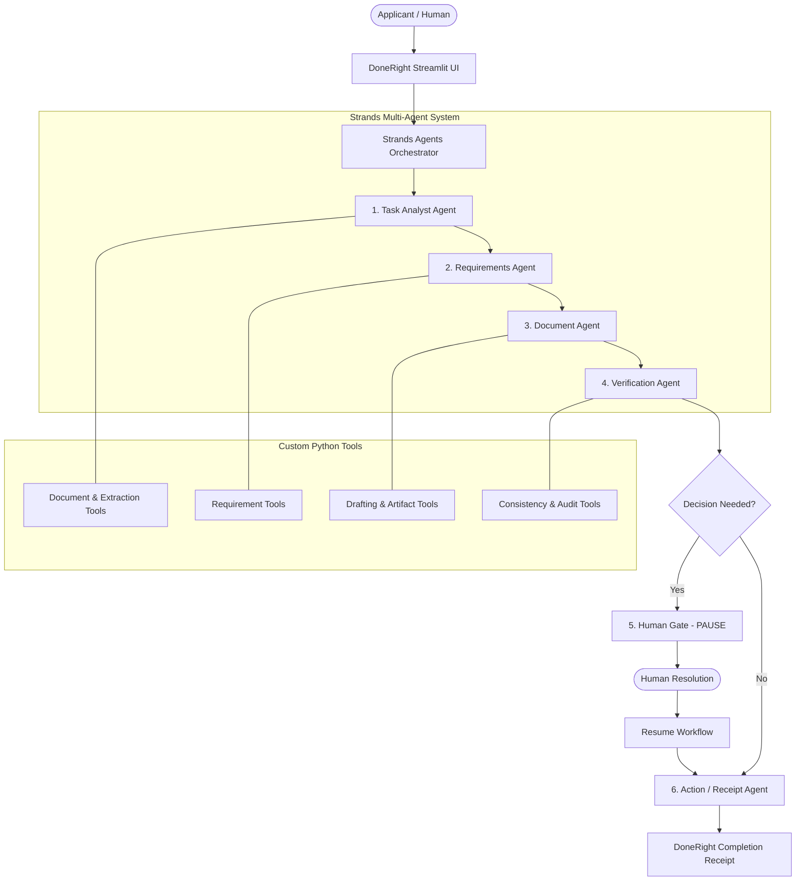

# DoneRight

> **Give it the task. DoneRight gets it done.**

DoneRight is an autonomous AI agent application built for the **Agents for Humans Hackathon** (Everyday Agents track). It takes messy real-world opportunities (scholarships, grants, fellowship calls), itemizes all requirements, ingests applicant documents, drafts grounded application statements without hallucinating credentials, verifies the application package, halts at a stateful **Human Gate** when human decision-making is genuinely required, and resumes to deliver a verified **Completion Receipt**.

---

## 1. The Core Idea: *Automate execution. Escalate judgment.*

Most scholarship applications don't fail because candidates lack merit—they fail because candidates drown under dozens of complex administrative requirements, deadlines, formatting guidelines, and tracking bottlenecks.

Chatbots merely chat: *"Here are some tips for your essay."*  
**DoneRight manages and executes the task:**
1. Ingests raw guidelines (PDF, text, markdown).
2. Extracts structured criteria via specialized Strands agents.
3. Audits applicant CVs and transcripts for eligibility (e.g. GPA thresholds, degrees).
4. Drafts grounded statements using verifiable achievements.
5. Performs an independent cross-document audit.
6. **Escalates to the Human Gate:** When a confidential third-party recommendation letter is missing, DoneRight pauses and refuses to forge it. It presents actionable choices to the human.
7. **Resumes upon human choice:** Seamlessly transitions into final verification and produces an official **Completion Receipt**.

---

## 2. System Architecture



```text
                    USER
                     │
                     ▼
          DoneRight Streamlit UI
                     │
                     ▼
           STRANDS ORCHESTRATOR
                     │
       ┌─────────────┼─────────────┐
       ▼             ▼             ▼
 Task Analyst   Requirements   Document Agent
       │             │             │
       └─────────────┼─────────────┘
                     ▼
             Verification Agent
                     │
                     ▼
               HUMAN GATE
                     │
                     ▼
             Action / Receipt
                     │
                     ▼
            Completion Receipt
```

---

## 3. Strands Agents SDK Integration

DoneRight uses the official **AWS Strands Agents SDK** (`strands-agents`):
* **Genuine Strands Agents:** Implements `strands.Agent` instances for the Orchestrator, Task Analyst, Requirements Agent, Document Agent, Verification Agent, and Receipt Agent.
* **Model Agnostic Integration:** Uses `strands.models.gemini.GeminiModel` (`gemini-3.6-flash`), with built-in pluggable support for `strands.models.BedrockModel` (Claude 3.5 Sonnet / Amazon Nova).
* **Stateful Orchestration:** True pause-and-resume workflow state machine with persistent serialization.

---

## 4. Anti-Hallucination Guardrails

DoneRight strictly enforces anti-hallucination rules:
1. **Never fabricates applicant credentials, GPAs, or experiences.**
2. **Never attempts to forge or simulate confidential recommendation letters from third parties.**
3. If information is absent, it is strictly flagged as `MISSING` and escalated to the **Human Gate**.
4. Every drafted application statement cites only grounded evidence extracted from the candidate's verified records.

---

## 5. Quickstart & Installation

### Prerequisites
* Python 3.10+ (tested on Python 3.13)
* Google Gemini API key or AWS Bedrock credentials

### Setup

```bash
# 1. Clone repository
git clone <repo-url>
cd "agent for humans"

# 2. Install dependencies
pip install -r requirements.txt

# 3. Configure environment
cp .env.example .env
# Add your GEMINI_API_KEY in .env
```

### Running the Application

```bash
streamlit run app/ui/main.py
```
Open `http://localhost:8501` in your browser.

---

## 6. Running the Automated Test Suite

```bash
python -m pytest tests/ -v
```

Tests cover:
* Pydantic schemas and state machine serialization (`tests/test_schemas.py`)
* Document parsing, GPA extraction, requirement matching, and verification checks (`tests/test_tools.py`)
* Live multi-agent orchestration, Human Gate pause, and resumption (`tests/test_workflow.py`)

---

## 7. 3-Minute Hackathon Demo Script

1. **0:00 - 0:20 (The Problem):** Show how managing scholarship requirements manually leads to missed deadlines and incomplete packages.
2. **0:20 - 0:40 (Task Intake):** Click **`Load Meridian Fellowship Preset`** to ingest the scholarship RFP along with Alex Rivera's CV and transcript.
3. **0:40 - 1:30 (Autonomous Agent Execution):** Click **`Start DoneRight`**. Watch the Strands agents autonomously analyze requirements, verify a 3.82 GPA, and draft a grounded Statement of Purpose.
4. **1:30 - 2:10 (The Human Gate):** Show the amber **Human Decision Required** card. Explain why DoneRight refuses to forge third-party referee recommendations.
5. **2:10 - 2:30 (Resumption):** Select *"Referee Submitting Directly to Portal"* and click **`Resume Workflow`**.
6. **2:30 - 3:00 (Completion):** Reveal the official **Completion Receipt** (`85% READY FOR SUBMISSION`), verified checkmarks, and preview the drafted Statement of Purpose.

---

## 8. Project Structure

```text
doneright/
├── app/
│   ├── agents/
│   │   ├── orchestrator.py        # Strands Orchestrator managing workflow & Human Gate
│   │   ├── task_analyst.py        # Strands Task Analyst agent
│   │   ├── requirements_agent.py  # Strands Requirements agent
│   │   ├── document_agent.py      # Strands Document agent
│   │   ├── verification_agent.py  # Strands Verification agent
│   │   └── receipt_agent.py       # Strands Receipt agent
│   ├── tools/
│   │   ├── document_tools.py      # Safe document parsing (PDF, MD, text)
│   │   ├── requirement_tools.py   # Checklist extraction & matching
│   │   ├── verification_tools.py  # Cross-document consistency & audits
│   │   └── artifact_tools.py      # Grounded statement drafting & receipt
│   ├── models/
│   │   └── schemas.py             # Strongly typed Pydantic models
│   ├── workflow/
│   │   └── state.py               # Workflow state persistence & serialization
│   ├── ui/
│   │   └── main.py                # Executive Obsidian & Champagne Bronze Streamlit UI
│   └── config.py                  # Model provider & environment configuration
├── demo/
│   ├── opportunity/
│   │   └── fellowship_announcement.md  # [Demo data] Meridian Fellowship RFP
│   └── documents/
│       ├── cv_alex_rivera.md           # [Demo data] Applicant CV
│       ├── transcript_alex_rivera.md   # [Demo data] Academic Transcript
│       └── project_summary.md          # [Demo data] Research project notes
├── tests/
│   ├── test_schemas.py
│   ├── test_tools.py
│   └── test_workflow.py
├── .env.example
├── .gitignore
├── LICENSE                        # Apache 2.0
├── README.md
└── requirements.txt
```

---

## 9. Limitations & Future Work

* **Simulated External Submissions:** While DoneRight prepares the complete application package and validates all portal submission rules, external HTTP POST submission directly into proprietary university portals is simulated for security and privacy.
* **Future Work:** Direct university portal browser automation, calendar sync for submission deadlines, and multi-referee email invitation dispatch.

---

## 10. License

Licensed under the [Apache License, Version 2.0](LICENSE).
